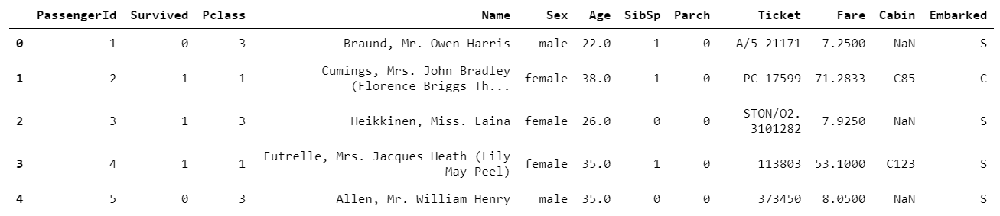
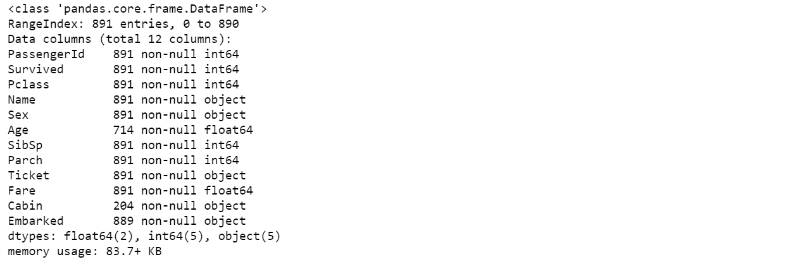
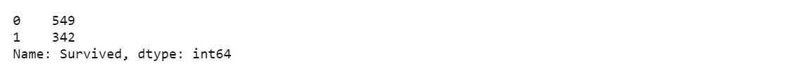
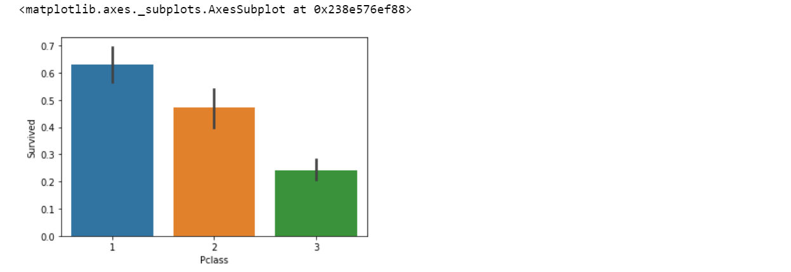
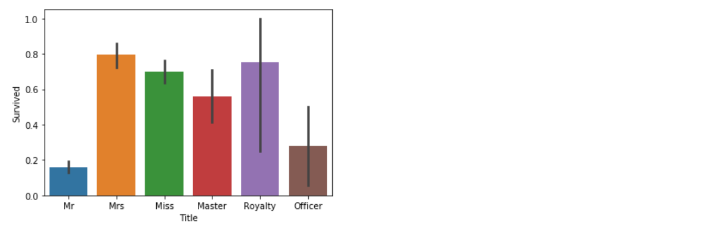
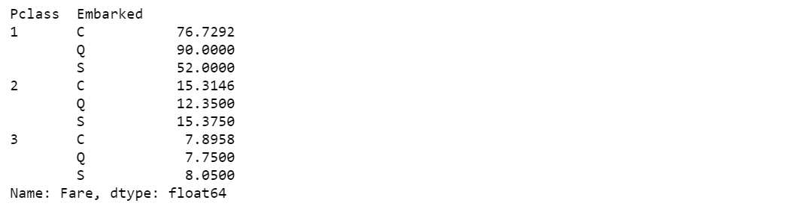

<!-- @import "[TOC]" {cmd="toc" depthFrom=1 depthTo=6 orderedList=false} -->

<!-- code_chunk_output -->

- [1 Baseline](#1-baseline)
  - [1.1 load data](#11-load-data)
  - [1.2 analise data](#12-analise-data)
  - [1.3 process data](#13-process-data)
  - [1.4 Build Model](#14-build-model)
  - [1.5 Predict Data](#15-predict-data)
- [2 Optimization 1st](#2-optimization-1st)
- [3 Optimization 2nd](#3-optimization-2nd)

<!-- /code_chunk_output -->

# 1 Baseline

## 1.1 load data
    pd.read_csv()
## 1.2 analise data
    1. train_set.head()

    
    2. train_set.info()

    3. explore the relationships between all the other features and the target 'Survival'
        e.g. train['Survived'].value_counts()
             sns.barplot(x = 'Pclass', y = 'Survived', data = train)

## 1.3 process data
    1. create new features
        a. Name -> Surname, Title
        b. Cabin -> Deck
        c. Sibsp + Parch + 1 -> FamilySize

    2. fill missing values(Age, Embarked and Fare)
        a. Age: (Sex, Title, Parch, Pclass) + RandomForestRegressor -> Age
        b. Embarked(missing two): Groupby(Pclass, Embarked) -> Fare.median -> Embarked
        c. Fare(missing one): (Pclass, Embarked) -> Fare.median

    3. transform features
        a. select features:
            all_data = all_data[['Survived', 'Pclass', 'Sex', 'Age', 'Fare', 'Embarked', 'Surname', 'Title', 'Deck', 'FamilySize', 'TicketGroup']]
        b. transform features:
            all_data = pd.get_dummies(all_data)
        c. split into train and test

## 1.4 Build Model
    1. optimize parameters: automatically select the optimal parameters using grid search
    
    2. train model: RandomForestClassifier
    
    3. estimate model: 10-fold cross validation -> CV Score : Mean - 0.827166 | Std - 0.0396002

    4. real test score: 0.77272

## 1.5 Predict Data

# 2 Optimization 1st
    1. add new features
        a. FamilySize -> IsAlone
        b. Fare -> CategoricalFare
        c. Age -> CategoricalAge

    2. show the correlations of current features
    
    3. estimate model: 10-fold cross validation -> CV Score : Mean - 0.8384395 | Std - 0.0405893

    4. real test score: 0.76794

# 3 Optimization 2nd
    1. xgboost
    
    2. estimate model: 10-fold cross validation -> CV Score : Mean - 0.8114357 | Std - 0.0509861

    3. real test score: 0.75119

# 4 Optimization 3rd
    1. Deep Neural Network

    2. delete features based on correlation matrix

    3. train on the kaggle

    4. real test score: 0.78249